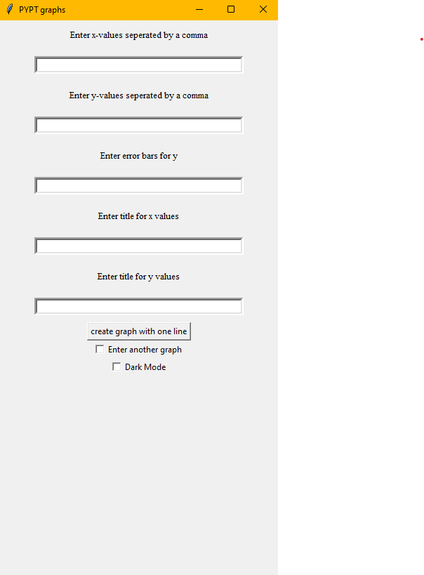
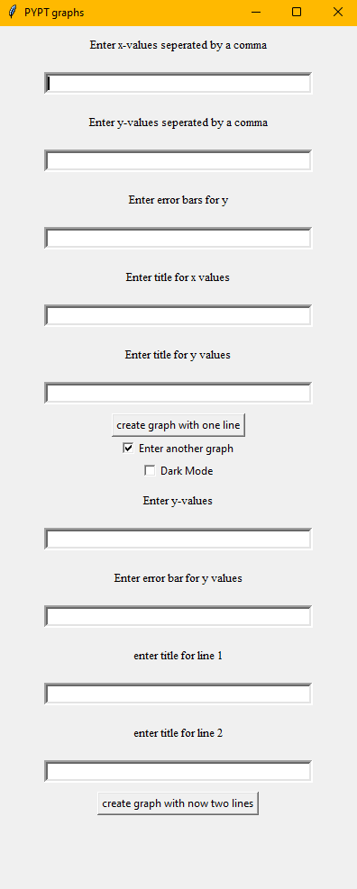
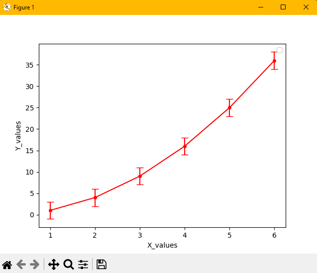
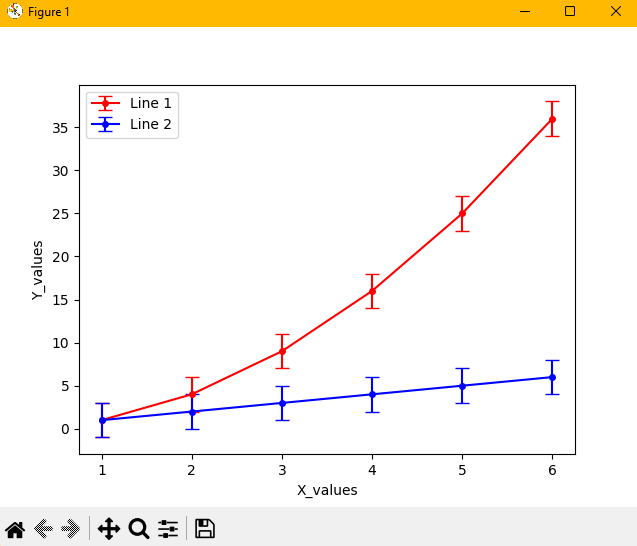
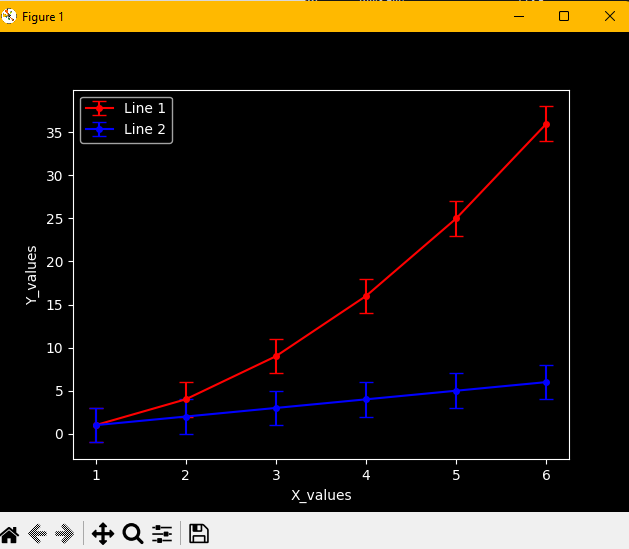

# MatPlotLib-Graph-Customization

This is a simple Python program designed to assist in creating graphs for scientific experiments, this was particularly created for the Pakistan Young Physicist Tournament (PYPT) but can be used for any graphs. This tool provides a user-friendly interface for generating graphs with various options, including the ability to create graphs with one or two lines, toggle dark mode, and more.

## Features

- **Graphs with One Line:** Create graphs with a single set of data, complete with error bars and customizable labels.

- **Graphs with Two Lines:** Generate graphs with two sets of data, allowing for easy comparison between variables.

- **Dark Mode:** Switch between light and dark modes for a more comfortable viewing experience.

## Screenshots

### Interface with One Line

### Interface with Two Lines

### Graph with One Line

### Graph with Two Lines

### Dark Mode

## Usage

1. Launch the program using `python main.py`.

2. Enter the required data, such as x-values, y-values, error bars, and titles.

3. Select the desired graph type (one line or two lines) and customize further options.

4. Click the "Create Graph" button to generate the graph.

5. Toggle dark mode on or off as needed.

## Requirements

- Python 3.x
- Matplotlib
- Tkinter (usually included with Python)

## How to Contribute

Contributions are welcome! If you have suggestions for improvements or new features, please open an issue or create a pull request.

